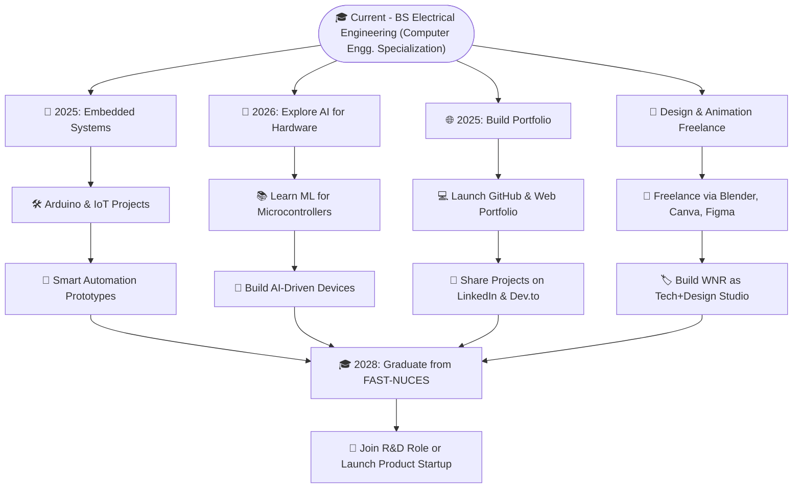

<h1 align="center"> 

</h1>
<h2 align="center">An Ardent | Innovative Developer | Proudly Representing PAKISTAN 🇵🇰.</h2>

🚀 An innovative and visionary Electrical Engineer whose expertise encompasses robotics, front-end web development, graphic design, video editing, and 3D modeling using Blender 🌀. At the helm of WNR Production Studio, a production house renowned for its creativity and innovation, exceptional logo designs are meticulously crafted through the use of Photoshop 🎨 and Adobe Illustrator ✒️. These logos are developed with precision to establish unique brand identities and captivate audiences.

Proficiency has been acquired in programming languages such as C ⚙️, C++ 🖥️, HTML 🌐, CSS 🎨, and JavaScript 📜 through diligent practice and application. Additionally, tools like Arduino IDE ⚡ and VS Code 💻 are utilized to deliver innovative solutions. Expertise has also been developed in leveraging Microsoft 365 tools, including Excel 📊, Word 📝, PowerPoint 📑, Teams 💬, and Office 🖥️, to create professional and impactful presentations that effectively communicate complex ideas.

The journey undertaken in this field is fueled by an unwavering commitment to integrating creativity with technical proficiency. A strong emphasis is placed on delivering innovative solutions and transformative designs that inspire progress and leave a meaningful impact. With every project, the aim is to exceed expectations and contribute positively to both the professional and creative landscapes.

That's it.
**************

<h2>Statistical figures</h2>

###

  

 

 

  
 &nbsp;
  
  &nbsp;
  

 

  
 

  

 
 

****************************

<h2>To view My Resume Click below:</h2>

 

Click to catch visuals.

  

  
- 🔭 I’m currently working on **Web development & C++**

- 🌱 I’m currently learning **HTML, CSS, JAVA, C++, PYTHON, PHOTOSHOP, CANVA, CAPCUT, ADOBE ILLUSTRATER, BLENDER**

- 👨‍💻 All of my projects are available at [wnr.github.io](wnr.github.io)

- 💬 Ask me about **C++, logo designing, Graphic Designing, Web development**

-------

<h1 align="left">Connect with me:</h1>

- 📫 How to reach me **waleednaeem133@gmail.com**
- GitHub -> 
- Instagram ->
- X-twitter -> 
- Gravatar ->
- Patreon ->
- Wordpress -> 
- Facebook -> 
- E-mail ->
- E-mail -> 
- school E-mail -> 

- 📄 Know about my experiences  

------

# 💻Tech Stack  

| **Programming Languages** |  |
|:---------------------------:|:--------------------------------------------------------------------------------------------------------------------------------------------------------------------------------------------------------------|
| **Frontend Development** |   | 
| **Backend Development**  |   |
| **Databases**            |   |
| **Softwares**            |     |
| **IDEs**                 |  
|**Gaming Engine's**       |  
| **Others**               |    |
 

<!--
<h1 align="left"> Languages </h1>

  
  
  
  
  
  
  
  
  
  
  
  
  
  
  
  

<h1 align="left"> Tools </h1>

  
  
  
  
  
  
  
  
  
  
  
  
  
  
  
  
  
  
  
  
  
  
  
  
  
   
  
  
  
  
  
  
  
  
  
  
  

-->
------
  ## 🌟 Wrapping Up...

<!-- Add a "Buy Me a Coffee" button -->

<!-- Add a timezone indicator -->

----

## 🔮 Future Roadmap

