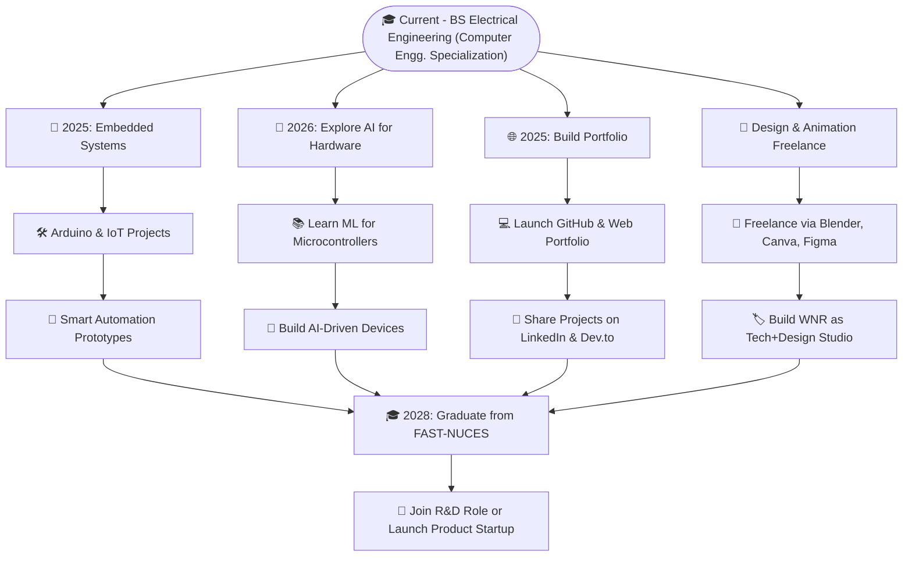
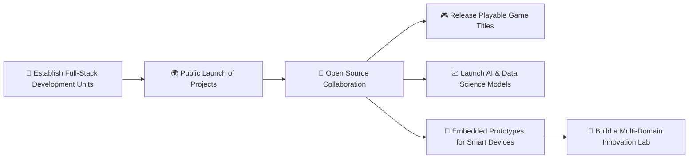

# ⚙️ WNR-PRODUCTION-STUDIO

> **"We Build the Future, Byte by Byte."**  
> *A unified IT Hub — powering innovation across software, data, design & games.*

---

## 🔍 Purpose

`WNR-PRODUCTION-STUDIO` is a full-spectrum **technology organization** founded by [Engr. Muhammad Waleed](https://github.com/W-N-R), focused on leading the development of modern, impactful IT solutions.

It acts as the **central command** and parent studio for projects involving:

- 🎮 **Game Development**
- 📱 **App Development**
- 🌐 **Web Development**
- 📊 **Data Analysis & Visualization**
- 🤖 **AI & Data Science**
- 🔌 **Embedded Systems & Automation**

---

## 🧩 Organizational Structure

🔗 XOST-GAME-STUDIO — a sub-organization dedicated entirely to game development, currently prototyping in C++ & SFML with future transitions planned to Unity, Godot, and Unreal Engine.

# 🧠 Founder

👤 Engr. Muhammad Waleed

Electrical & Computer Engineering | Hardware Programmer | Game Dev Enthusiast | Founder of WNR Studio
Passionate about bridging software with hardware and creating innovative, purposeful tech.

# 🗂️ Featured Projects (and upcoming)

| Project                              | Status          | Description                                              |
| ------------------------------------ | --------------- | -------------------------------------------------------- |
| 🎮 **2D Platformer Engine (SFML)**   | 🧪 Experimental | Lightweight C++ game engine using SFML for XOST Studio   |
| 💡 **Smart LED Cube (Arduino)**      | ✅ Complete     | A C++ multiplexed 4x4x4 LED cube with animation controls |
| 🚗 **Car Showroom Management (C++)** | ✅ Complete     | Inventory + Customer DB CLI app built using OOP in C++   |
| 📊 **IoT Weather Dashboard**         | 🔜 Planned      | Real-time ESP32 + Web Dashboard integration              |
| 🧠 **AI + Embedded (TinyML)**        | 🔜 Research     | On-device AI integration into embedded hardware          |
| 🌐 **Portfolio Website Template**    | 🧪 Alpha        | Responsive developer portfolio with project highlights   |

# 🧭 Mission Statement

"To serve as a launchpad for creative developers, researchers, and engineers
united under a single vision — building meaningful tech for the real world."

# 🧑‍💻 Join or Collaborate
We welcome:

Contributors (C++, Python, JS, ML, UI/UX)

Game testers and feedback givers

Designers and animators

Data scientists and AI enthusiasts

💬 Interested? Open a pull request, fork a repo, or contact us through GitHub Discussions!

# 🏁 Stay Connected
🔗 Organization: WNR-PRODUCTION-STUDIO

🧠 Founder: W-N-R

🎮 Game Dev Arm: XOST-GAME-STUDIO

🌐 Web: [Coming Soon]

© 2025–Future | All rights reserved by WNR-PRODUCTION-STUDIO & XOST-GAME-STUDIO
