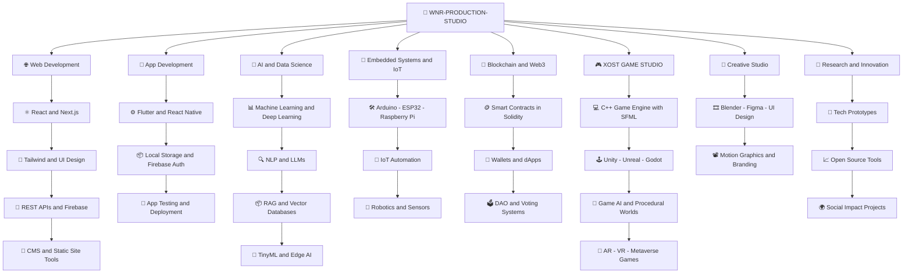

# ⚙️ WNR-PRODUCTION-STUDIO

> **"We Build the Future, Byte by Byte."**  
> *A unified IT Hub — powering innovation across software, data, design & games.*

---

## 🔍 Purpose

`WNR-PRODUCTION-STUDIO` is a full-spectrum **technology organization** founded by [Engr. Muhammad Waleed](https://github.com/W-N-R), focused on leading the development of modern, impactful IT solutions.

It acts as the **central command** and parent studio for projects involving:

- 🎮 **Game Development**
- 📱 **App Development**
- 🌐 **Web Development**
- 📊 **Data Analysis & Visualization**
- 🤖 **AI & Data Science**
- 🔌 **Embedded Systems & Automation**

---

## 🧩 Our Vision

> 🎮 **Game Dev Division**: [XOST-GAME-STUDIO](https://github.com/XOST-GAME-STUDIO)  
> 👤 **Founder**: [Engr. Muhammad Waleed](https://github.com/W-N-R)

---

## 🗂️ Projects (Samples)

| Project                                  | Status       | Description                                                    |
|------------------------------------------|--------------|----------------------------------------------------------------|
| 🔲 [LED Cube 4x4x4](https://github.com/W-N-R/My-Electronics-Embedded-Systems-Project-Hub-/tree/main/4%20X%204%20X%204_MATRIX_Ardiuno%20nano%20project)             | ✅ Complete   | Arduino-based 3D cube with multiplexed animations in C++       |
| 🚗 [Car Showroom System](https://github.com/W-N-R/-Car-Showroom-Sales-System-C-)   | ✅ Complete   | Inventory & customer management using OOP in C++               |
| 🎮 [2D Game Engine (SFML)](https://github.com/XOST-GAME-STUDIO)         | 🧪 In Progress | Lightweight C++ engine for platformers and arcade-style games  |
| 🌐 Portfolio Website Template             | 🧪 In Progress | Personal dev portfolio using HTML/CSS, deployed via GitHub Pages |
| 📊 IoT Weather Dashboard                  | 🔜 Upcoming   | Live temperature/humidity data from ESP32 to Web UI            |
| 🤖 TinyML on Microcontrollers             | 🔬 Research   | Running ML models on Arduino Nano / ESP32                      |
| 📱 AI Chatbot Web App                     | 🔜 Upcoming   | React + Flask chatbot using OpenAI API or local models         |
| 🧠 Hand Gesture Recognition using CV      | 🔜 Upcoming   | ML + OpenCV app for gesture-based control                      |
| 🪙 Decentralized Voting App (Solidity)    | 🧪 Prototype  | Ethereum smart contract for transparent voting                 |
| 📦 Firebase-Powered To-Do + Auth System   | ✅ Complete   | Full-stack project with Google Login and real-time updates     |
| 🎙 Text-to-Speech Bot (Python + Pyttsx3)  | ✅ Complete   | Voice assistant using offline libraries                        |
| 🎛 Smart Home Controller (ESP32 + Web UI) | 🔜 Research   | Control lights, fans, and sensors via web dashboard            |

---

## 🧭 Mission Statement

> _To be a launchpad for creative developers, researchers, and engineers — united under a single vision to build meaningful tech for the real world._

---

## 🧑‍💻 Join or Collaborate

We welcome:
- 💻 Developers (C++, Python, JS, Web, ML)
- 🎮 Game designers and testers
- 📊 Data scientists and analysts
- 🧑‍🎨 Designers, animators, and content creators

**Open a pull request, fork a repo, or start a discussion** — we’re open to passionate contributors!

---

## 🔗 Connect with Us

- 📦 **Main Org:** [WNR-PRODUCTION-STUDIO](https://github.com/WNR-PRODUCTION-STUDIO)  
- 🎮 **Game Studio:** [XOST-GAME-STUDIO](https://github.com/XOST-GAME-STUDIO)  
- 👤 **Founder:** [Engr. Muhammad Waleed](https://github.com/W-N-R)

---

 © 2025–Future | All rights reserved by WNR-PRODUCTION-STUDIO

